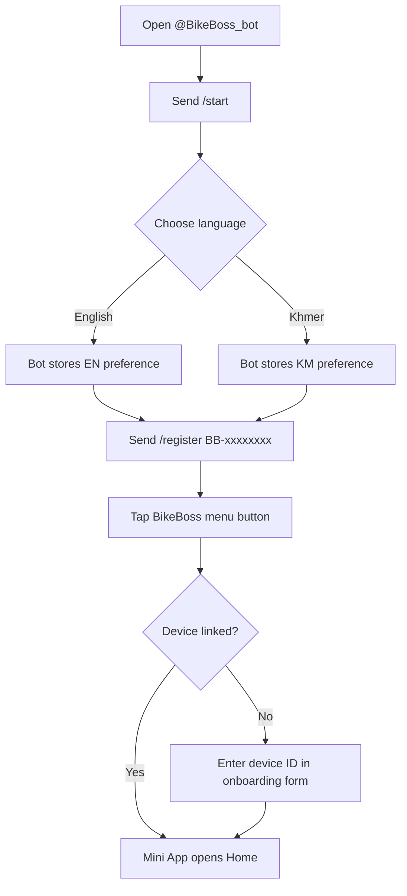
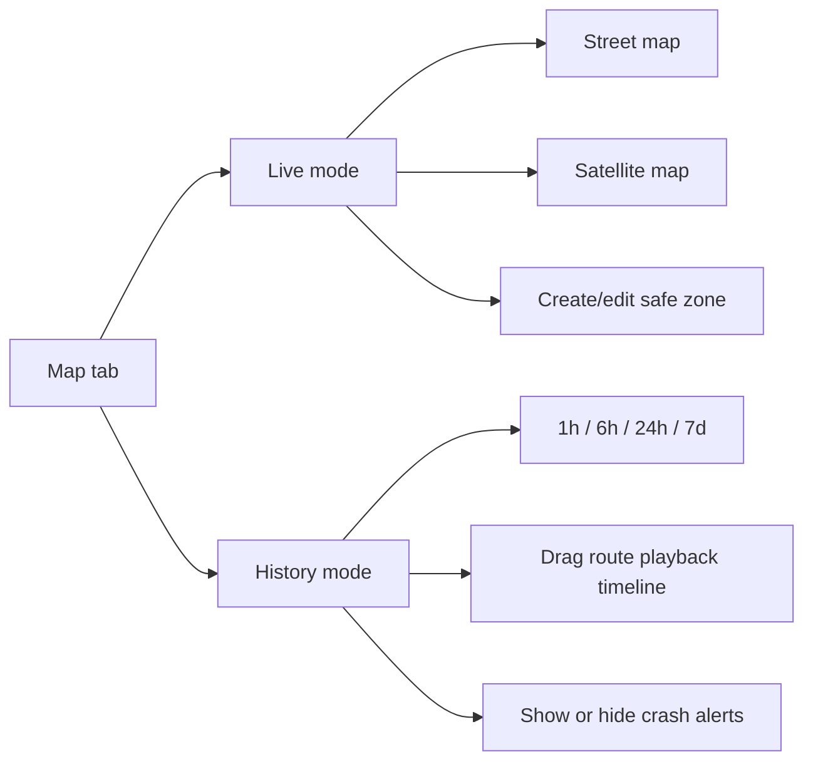
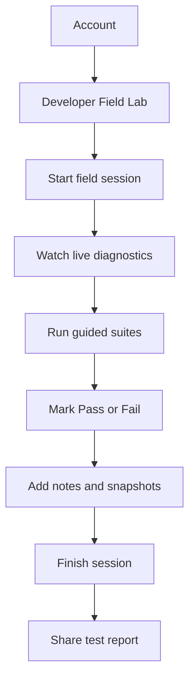

# BikeBoss Current Bot and Mini App User Guide

**Version:** V0.3
**Updated:** 10 August 2026
**Audience:** BikeBoss teammates, testers, and demonstrators
**Current environment:** Staging

This guide explains what the current BikeBoss Telegram bot and Mini App can do
today, how to use each function, and which features are still test-only or
hardware-limited.

---

## 1. What the User Can Use Today

```text
Telegram Bot
   ├─ Register a BikeBoss device
   ├─ Read status
   ├─ Read GPS location
   ├─ Arm or disarm the device
   ├─ Set a basic geofence
   ├─ Read recent trips
   ├─ Start a subscription payment
   └─ Change language / get help

Telegram Mini App
   ├─ Home: protection status and live bike information
   ├─ Map: live map, history, zones, events, street/satellite view
   ├─ Activity: trips, route details, and security events
   └─ Account: profile, payment, connection details, Wi-Fi, language, theme
```

The bot is useful for quick commands. The Mini App is the main, richer user
interface for maps, safe-zone editing, route playback, diagnostics, and trips.

---

## 2. Important Environment Note

The current complete feature set is deployed to **staging**:

- Mini App: <https://staging.bikeboss-app.pages.dev>
- API: <https://bikeboss-api-staging.sokpanha-nov1999.workers.dev>

The production site is not yet the target for the new v2 feature set. Always
check that the bot menu or URL says **BikeBoss Staging** before testing.

### Shared prototype test accounts

`BB-TEST0001` through `BB-TEST0005` can mirror the connected physical prototype
`BB-00000001`.

When a teammate uses one of these shared test registrations:

- Live status, GPS, battery status, history, trips, and activity are mirrored.
- Safe zones belong to that teammate's test account.
- Geofence breach alerts are disabled in shared mode.
- ARM and DISARM controls are locked for safety.
- Wi-Fi settings are read-only.

Use a dedicated device ID for a real owner-controlled device.

---

## 3. First-Time Setup



### Step-by-step

1. Open the BikeBoss bot in Telegram.
2. Send `/start`.
3. Choose **English** or **Khmer**. The choice controls both the bot messages
   and the Mini App language.
4. Link the device using either method:

   ```text
   /register BB-00000001
   ```

   or open the Mini App and enter the printed device ID in the onboarding form.

5. Tap the **BikeBoss** menu button to open the Mini App.
6. If the tracker has not sent telemetry yet, the app may show no GPS fix or an
   offline controller. Power the hardware and wait for its next heartbeat.

### Device ID rules

- Device IDs begin with `BB-`.
- Use capital letters and numbers, for example `BB-00000001`.
- A device already owned by another account cannot be linked again without a
  support transfer.

---

## 4. Bot Commands

Send these commands in the Telegram chat with the bot. Commands are not
case-sensitive in normal Telegram use, but use the spelling shown below.

| Command | What it does | What to expect |
|---|---|---|
| `/start` | Starts the bot or shows a welcome-back message | First use asks for language. Returning users see a link to use the app. |
| `/help` | Shows the command list | Safe to use at any time. |
| `/register BB-xxxxxxxx` | Links a device to the Telegram account | The device ID must be valid and not owned by someone else. |
| `/status` | Shows controller, arm state, GPS, speed, battery, subscription, and last event | Battery may say “not measured” until the 12 V sensor is installed. |
| `/locate` | Shows the newest GPS coordinate and Google Maps link | Requires a current GPS fix. |
| `/arm` | Queues the anti-theft ARM command | The device applies it on a later heartbeat. Shared test devices are locked. |
| `/disarm` | Queues the DISARM command | The device applies it on a later heartbeat. Shared test devices are locked. |
| `/geofence` | Creates a 100 m “Current Location” zone around the newest GPS fix | Requires a GPS fix. Use the Mini App for named zones and custom radius. |
| `/trips` | Lists the five most recent trips | Shows start time, distance, maximum speed, and safety score. |
| `/subscribe` | Opens the payment prompt | Current staging invoice uses a `$0.10` test amount. |
| `/lang en` or `/lang km` | Changes bot language | Mini App language follows the saved account preference. |

### Quick command examples

```text
/register BB-00000001
/status
/locate
/geofence
/trips
/lang km
```

### ARM/DISARM behavior

These commands are deliberately asynchronous:

```text
User taps ARM
      ↓
Cloud queues command
      ↓
Tracker receives it on its next heartbeat
      ↓
Tracker applies relay/security state
      ↓
Cloud stores acknowledgement
      ↓
App/bot shows final result
```

**Queued** does not mean the physical state has changed yet. Wait for
**Delivered** and then **Applied**. A failed or timed-out command must be
investigated before assuming the motorcycle is protected.

---

## 5. Mini App Navigation

The bottom navigation has four tabs:

```text
┌─────────┬─────────┬────────────┬─────────┐
│  Home   │   Map   │  Activity  │ Account │
└─────────┴─────────┴────────────┴─────────┘
```

The app refreshes current status automatically while it is visible. Pulling or
using the refresh button is useful after powering the tracker or changing a
setting.

---

## 6. Home Tab

The Home tab is the quick daily status view.

```text
Home
 ├─ Controller online/offline
 ├─ Armed / Disarmed / Pending
 ├─ Arm or Disarm button
 ├─ Battery voltage
 ├─ Speed
 ├─ GPS state
 ├─ Last heartbeat
 ├─ Current coordinates
 └─ Active safe zone
```

### Security panel

| Display | Meaning |
|---|---|
| **Armed / Protected** | Anti-theft state is armed according to the latest device telemetry. |
| **Disarmed / Unprotected** | Anti-theft state is not armed. |
| **Pending** | A command is waiting to be delivered or applied. |
| **Controller online** | Recent tracker heartbeat reached the cloud. |
| **Controller offline** | No heartbeat was received within the configured freshness window. |

Tap **Arm** or **Disarm**, read the confirmation sheet, then confirm. The
command status sheet shows `Pending → Delivered → Applied` or `Failed`.

### Vital cards

- **Battery:** vehicle battery voltage only when the physical divider is
  installed. “Sensor not connected” is currently expected on the USB-C bench.
- **Speed:** newest GPS speed; stationary filtering prevents small GPS spikes
  from starting a trip.
- **GPS:**
  - **Fixed:** current tracker heartbeat contains a valid GPS fix.
  - **Searching:** tracker is online but the receiver has no valid fix yet.
  - **Unavailable:** tracker is offline or the cloud has no current receiver
    observation.
- **Last seen:** age of the latest accepted tracker heartbeat.

### Location card

The location card shows coordinates and an **Open in Maps** link. If the GPS is
not currently fixed, the coordinates are labelled as last-known data rather
than presented as live.

Use **Manage safe zones** to open the Map tab.

---

## 7. Map Tab

The Map tab is the main tracking and geofence workspace.



### Live mode

- Shows the newest trusted location.
- Follows the motorcycle when automatic follow is enabled.
- Use the navigation/center button to return to the motorcycle.
- If you drag the map, camera follow pauses; **Return to live** restores it.
- Shows GPS quality, approximate accuracy, connection type, and data age.
- If the tracker is offline, the map keeps the last-known point and recorded
  trail instead of going blank.

### History mode

Choose one of these ranges:

- `1h` — recent detailed movement.
- `6h` — detailed route for a longer ride or day segment.
- `24h` — daily overview.
- `7d` — weekly overview with bounded sampling.

Use the timeline slider to move the directional bike marker through recorded
GPS samples. Purple lines are recorded continuous route segments. Dashed grey
lines indicate a telemetry gap and must not be treated as confirmed travelled
road.

History summary values include:

- Route distance.
- Number of GPS samples.
- Number of connection gaps.

The **Crash alerts** switch controls whether crash event markers appear on the
history map. It does not delete the events.

### Map layers and controls

| Control | Use |
|---|---|
| Street / Satellite | Change the background map. |
| Center motorcycle | Focus the map on the selected/current point. |
| Fit zones | Show all safe zones together. |
| Refresh | Request newer live or history data. |
| Return to live | Re-enable live camera follow after map movement. |

### Safe zones

To create a safe zone:

1. Open **Map** in Live mode.
2. Make sure a current location is available.
3. Tap **Create safe zone**.
4. Move the map so the crosshair is at the zone center.
5. Choose a preset name: Home, Work, School, or Parking, or type a custom name.
6. Set the radius from `50 m` to `1000 m`.
7. Tap **Save zone**.

To edit a zone, tap its circle or list card, choose edit, adjust the center,
name, radius, or status, and save. Zones can be **Active**, **Paused**, or
**Archived**.

To understand alerts:

```text
Inside safe zone
      ↓ two accurate outside observations
Exit candidate
      ↓ confirmation
Geofence breach alert
      ↓ two accurate inside observations
Return candidate
      ↓ confirmation
Bike returned to safe zone
```

The cloud uses GPS accuracy, hysteresis, speed and multiple samples to reduce
alerts caused by ordinary GPS drift.

### Shared prototype map behavior

Shared test accounts can create and inspect their own zones, but those zones do
not send real breach alerts. The displayed GPS and route belong to the shared
physical prototype.

---

## 8. Activity Tab

Activity has two views:

```text
Activity
 ├─ Trips
 └─ Events
```

### Trips

Each trip card can show:

- Start time.
- Trip status: ongoing or completed.
- Distance.
- Maximum speed.
- Average speed.
- Safety score.
- Eco score.

Tap a trip to open its detail sheet. The detail view includes the recorded route
map, start/end times, duration, distance, speed statistics, and scores.

Trips are created automatically when the tracker confirms movement. A short
stop remains part of the same trip; a longer stationary period closes it.

### Events

Events can include:

- Geofence breach.
- Geofence return.
- Crash detected.
- Power cut.
- ARM/DISARM.
- Motion with GPS loss.

Tap an event to view its evidence and acknowledge it where available. Acknowledging
an event records that a user has seen it; it does not erase the event.

---

## 9. Account Tab

```text
Account
 ├─ Telegram profile
 ├─ Subscription
 ├─ Device information
 ├─ Connection details
 ├─ Trusted Wi-Fi profiles
 ├─ Language
 ├─ Theme
 └─ Developer Field Lab (staging only)
```

### Profile

Shows the Telegram display name, username, and profile photo when Telegram
provides one. The server still uses validated Telegram session data for account
security.

### Subscription

Shows the current expiry date and whether the subscription is active.

To test payment in staging:

1. Tap **Extend**.
2. Review the invoice and expiry time.
3. Scan the displayed KHQR with ABA Mobile or Bakong, or open the payment link.
4. The app checks payment status automatically.
5. After confirmation, the subscription is extended by 365 days.

> **Staging payment note:** The backend currently uses a `$0.10` test amount.
> The normal product copy says `$15/year`; do not treat the staging price as the
> production price.

Invoices expire after 15 minutes. Create a new invoice if one expires.

### Connection details

The connection sheet intentionally separates three links:

```text
Tracker ─────> BikeBoss Cloud ─────> This phone
```

The tracker and phone may use different networks.

Tracker information can include:

- Online/offline state.
- Wi-Fi or mobile internet.
- Cellular generation.
- Saved profile label.
- Signal strength.
- Last heartbeat.
- GPS receiver state.

Phone information can include:

- Phone online/offline state.
- Network quality, latency, and estimated downlink when the Telegram WebView
  exposes them.
- The actual Wi-Fi name or carrier is intentionally not shown when unavailable.

GPS collection continues on the tracker even when the internet is temporarily
unavailable. The tracker queues data and replays it when a connection returns.

### Trusted Wi-Fi

The current app can manage up to eight trusted Wi-Fi profiles:

1. Open **Account → Connection details → Manage networks**.
2. Tap **Add network**.
3. Enter a friendly label, exact SSID, password, and priority.
4. Save the profile and wait for the device synchronization indicator.

Priority options are preferred, normal, and backup. The tracker scans saved
profiles, avoids weak-network flapping, and uses A7670G cellular when trusted
Wi-Fi is unavailable. Passwords are write-only in the app and stored encrypted
for the device.

On shared prototype accounts, Wi-Fi profiles are read-only.

### Language and theme

- Choose **English** or **Khmer**. The preference applies to the Mini App and
  bot notifications.
- Choose **Auto**, **Light**, or **Dark** theme.
- The top-right avatar opens Account quickly.
- The moon/sun button toggles the theme.

---

## 10. Developer Field Lab

The Developer Field Lab is visible only in staging/development builds. It is a
phone-only checklist for field testers, not a normal rider feature.



Live diagnostics include:

- Controller online/offline.
- GPS fix, satellites, and accuracy.
- Wi-Fi/cellular uplink and signal.
- Motion and speed.
- Vehicle battery measurement, when the sensor exists.
- Telemetry sequence number.

The current guided suites cover GPS, hotspot recovery/offline buffering,
geofencing, crash calibration, power/backup, relay safety, and a complete
phone-only trip.

Test results and up to 20 evidence snapshots stay in the phone's local storage
until the tester shares the report or starts a new session. The tool does not
automatically send dangerous relay or crash commands.

### Safety rules

- Park securely before testing.
- Never test the relay while riding.
- Never create a real road impact to test crash detection.
- Test power-cut wiring only with the engine off and a safe backup plan.
- Use two people for physical relay or wheel tests when possible.

---

## 11. Understanding Common Status Messages

| Message | Plain meaning | What to do |
|---|---|---|
| Controller online | The cloud recently received a tracker heartbeat. | Normal; check GPS separately. |
| Controller offline | The cloud has not received a recent heartbeat. | Check tracker power, Wi-Fi/SIM, and wait for reconnect. |
| GPS fixed | The latest online telemetry has a valid GPS fix. | Location can be treated as current within its age and accuracy. |
| GPS searching | Tracker is online but the receiver has no confirmed fix. | Move the antenna outdoors with open sky and wait. |
| GPS unavailable | The tracker is offline or the cloud cannot confirm a current fix. | Do not treat cached coordinates as live. History may still be available. |
| Vehicle battery: Sensor not connected | The 12 V divider is not installed/enabled. | Expected on current USB-C bench; not a battery failure. |
| Pending command | Cloud accepted the request but the device has not applied it. | Wait for the next heartbeat. |
| Delivered to device | Device received the command. | Wait for Applied acknowledgement. |
| Applied | Device confirmed the new state. | Physical state is confirmed by telemetry. |
| Failed / timed out | Device did not confirm the command. | Do not assume ARM/DISARM succeeded; inspect power and connection. |
| Dashed history route | A period had no delivered GPS samples. | The dashed section is not confirmed travelled distance. |
| Shared test controls locked | The account mirrors a shared prototype. | Use a dedicated device for real controls. |

---

## 12. Common Workflows

### Daily status check

```text
Open bot or Mini App
    ↓
Home → Controller online?
    ↓
GPS fixed and Last seen recent?
    ↓
Check Armed/Disarmed state
    ↓
Open Map if location or route detail is needed
```

### Park and create a safe zone

1. Park the motorcycle.
2. Wait for **Controller online** and **GPS fixed**.
3. Open **Map → Live**.
4. Tap **Create safe zone**.
5. Center the crosshair, name the zone, and choose a radius.
6. Save the zone.
7. Arm the motorcycle only after checking the command reaches **Applied**.

### Review where the motorcycle travelled

1. Open **Map**.
2. Choose **History**.
3. Select `1h`, `6h`, `24h`, or `7d`.
4. Drag the timeline to inspect the directional marker.
5. Check distance, sample count, and route gaps.
6. Open **Activity → Trips** for trip-level speed and score details.

### Test reconnect behavior

1. Start a Developer Field Lab session.
2. Confirm a live heartbeat and GPS fix.
3. Turn off or move out of range of the trusted hotspot.
4. Confirm the app eventually reports the tracker as offline/stale.
5. Keep the tracker moving only in a safe test area; its points should queue.
6. Restore Wi-Fi and confirm ordered replay fills the history.
7. Record any gaps and share the field report.

### Respond to a geofence alert

1. Read the Telegram alert and check the time, zone, speed, and location.
2. Open **Map** to inspect the current/last-known position and route.
3. Open **Activity → Events** to inspect evidence.
4. Acknowledge the event after reviewing it.
5. Contact the rider or follow the team's physical response procedure.

---

## 13. Troubleshooting

### App says no device linked

Send `/register BB-xxxxxxxx` in the bot or use the onboarding form inside the
Mini App. Confirm the ID is printed on the device and belongs to this account.

### App says controller offline

Check that both boards are powered, the common ground is connected, and the
tracker can see its trusted Wi-Fi or SIM network. USB-C provides power during
the bench test; unplugging it will eventually make the controller stale.

### GPS is searching or unavailable

Attach the active antenna to the **L76K** connector, place it outdoors with open
sky, and wait for a fresh fix. The A7670G is the modem; it is not the source of
GPS data on this LilyGO board.

### Battery says sensor not connected

This is expected on the current USB-C bench. The 12 V battery divider is not
installed. Never connect 12 V directly to XIAO D0 or any 3.3 V pin.

### ARM/DISARM remains pending

Wait for a heartbeat. If it fails or times out, check tracker power/uplink and
do not assume the physical immobilizer changed state. Shared prototype accounts
cannot run these commands.

### History has a dashed line or missing section

The tracker did not deliver samples during that interval. The app keeps the gap
visible so it does not invent a straight route. Check the tracker connection and
wait for offline replay.

### Payment invoice expired

Invoices are valid for 15 minutes. Close it and create a new invoice. The
current staging amount is a test amount, not the final production price.

---

## 14. Current Limitations to Tell Testers

- The complete experience is staging-only.
- Shared prototype accounts are read-only for hardware controls and do not send
  geofence alerts.
- Vehicle battery voltage is not measured until the divider is installed.
- Real 4G data has not passed a complete SIM acceptance test.
- Backup LiPo switchover has not yet been physically verified.
- BLE owner authentication is not complete; ordinary BLE must not be treated as
  proof of ownership.
- A GPS point is always interpreted together with its age and accuracy.
- A cloud “online” status means a recent heartbeat, not proof that the
  motorcycle's 12 V battery is connected.

## 15. Quick Reference Card

```text
START       /start
HELP        /help
LINK        /register BB-xxxxxxxx
STATUS      /status
LOCATION    /locate
ARM         /arm
DISARM      /disarm
GEOFENCE    /geofence
TRIPS       /trips
PAYMENT     /subscribe
LANGUAGE    /lang en   or   /lang km

Mini App: Home | Map | Activity | Account
Staging:  https://staging.bikeboss-app.pages.dev
```

## Final Explanation

The current BikeBoss bot is the quick command interface, while the Mini App is
the complete control and review interface. The software can already receive and
display real tracker data, preserve route history, detect geofence changes, and
record trips. Testers should always separate three questions: **Is the
controller online? Is GPS current and accurate? Is the motorcycle battery
actually measured?** These are different states in the current system.
