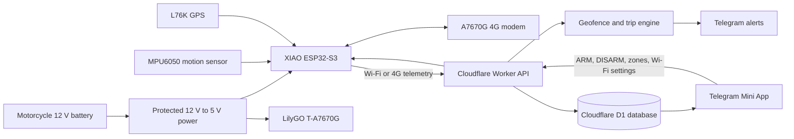
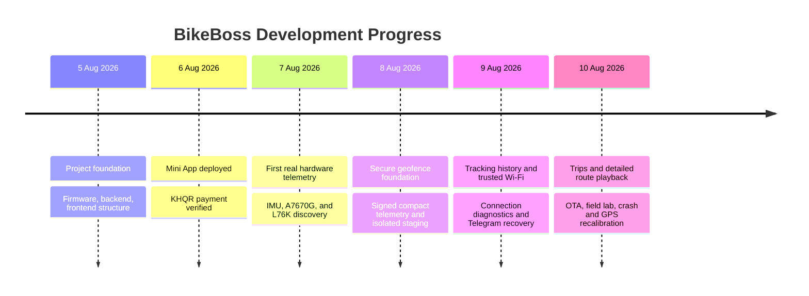

# BikeBoss Project Progress Summary

**Updated:** 10 August 2026
**Purpose:** Give the team an easy-to-understand view of the project scope,
completed work, current prototype status, and remaining work.

---

## 1. Project in One Sentence

BikeBoss is a motorcycle security and tracking system that uses an on-bike
device, cloud services, and a Telegram Mini App to show the motorcycle's
location, record trips, detect danger, and alert the owner.

## 2. Current Status at a Glance

| Area | Status | Meaning |
|---|---|---|
| Hardware bench prototype | **Working** | GPS, IMU, Wi-Fi, modem communication, and cloud telemetry were tested with real boards. |
| Firmware | **Working in staging** | The XIAO collects sensor data, sends signed telemetry, stores offline data, and supports Wi-Fi OTA updates. |
| Cloud backend | **Working in staging** | Cloudflare receives telemetry, stores history, checks geofences, detects trips, and sends Telegram alerts. |
| Telegram Mini App | **Working in staging** | Users can see live status, maps, route history, trips, safe zones, and connection diagnostics. |
| Motorcycle 12 V installation | **Not installed yet** | The protected 12 V power circuit, voltage sensor, and backup-power switchover still need installation. |
| Real 4G operation | **Partially tested** | The A7670G responds to commands, but no active SIM has been installed for a complete cellular data test. |
| Production release | **Not released yet** | The new system remains isolated in staging until the physical field tests are completed. |

> **Simple conclusion:** The main product works as a connected bench prototype
> and staging application. The remaining work is mainly motorcycle power,
> cellular, relay, backup-battery, BLE security, and outdoor acceptance testing.

---

## 3. Project Scope

### Primary scope

The current main goal is reliable motorcycle tracking and geofencing:

1. Show the motorcycle's live and last-known location.
2. Let the owner create safe zones around home, work, school, or parking.
3. Detect when the motorcycle leaves or returns to a safe zone.
4. Send a Telegram alert when a possible theft event occurs.
5. Keep route history even when the tracker temporarily loses internet.

### Supporting scope

- Automatic trip recording and trip statistics.
- Crash detection using the MPU6050 motion sensor.
- ARM/DISARM and future engine immobilizer control.
- Wi-Fi and 4G connectivity with offline storage.
- Motorcycle battery monitoring and power-cut alerts.
- English and Khmer Telegram experience.
- ABA PayWay/KHQR subscription payments.
- Future safe-zone suggestions based on parking history.

### Not complete in the current phase

- Real motorcycle relay and immobilizer installation.
- Complete 12 V power and backup-battery installation.
- Real SIM-based 4G telemetry acceptance test.
- Authenticated BLE owner-presence challenge.
- Trained AI theft/jitter classifier.
- Automatic safe-zone activation.
- Production migration of the complete staging system.

---

## 4. How BikeBoss Works



### Data flow in plain language

1. The L76K GPS finds the motorcycle's position.
2. The MPU6050 measures movement, lean, rotation, and impact.
3. The XIAO combines the sensor data into a small signed message.
4. The message is sent using trusted Wi-Fi or the A7670G modem.
5. Cloudflare verifies and stores the message.
6. The cloud checks safe zones and creates or updates trips.
7. The Telegram Mini App shows the result to the owner.
8. Important events generate Telegram alerts.

---

## 5. Hardware Progress

### Hardware used

| Component | Role | Current result |
|---|---|---|
| Seeed XIAO ESP32-S3 | Main controller | Flashed, tested, and updated through authenticated Wi-Fi OTA. |
| LilyGO T-A7670G | Cellular board | A7670G responds to `AT`; real SIM data test remains. |
| External L76K | GPS receiver | Real NMEA and outdoor GPS fixes were received. |
| MPU6050 | Motion and crash sensor | Calibrated and stable near normal gravity at rest. |
| Relay output | Immobilizer control | Firmware control exists; motorcycle relay installation remains. |
| Buzzer output | Local alert | Firmware output is assigned; final enclosure installation remains. |
| Battery ADC input | 12 V measurement | XIAO D0 is reserved, but the safe voltage divider is not installed. |
| Backup LiPo | Power-cut support | Planned, but automatic power switchover is not yet verified. |

### Verified bench wiring

```text
MPU6050 SDA       -> XIAO D4
MPU6050 SCL       -> XIAO D5
MPU6050 VCC/GND   -> XIAO 3V3/GND

L76K GPS TX       -> LilyGO GPIO22 -> XIAO D2
A7670G modem TX   -> LilyGO GPIO27 -> XIAO D6
A7670G modem RX   -> XIAO D7 -> LilyGO GPIO26
LilyGO GND        -> XIAO GND

Relay signal      -> XIAO D1
Buzzer signal     -> XIAO D3
Battery voltage   -> Protected divider -> XIAO D0 (not installed yet)
```

### Hardware results already proven

- The XIAO and LilyGO firmware can be flashed independently.
- The XIAO received real GPS data without a PC forwarding coordinates.
- Real GPS coordinates were sent to Cloudflare and stored in D1.
- The MPU6050 calibration corrected the rest value to about `9.81 m/s2`.
- Crash false positives caused by normal motorcycle lean were corrected.
- Stationary GPS speed noise is filtered before movement starts a trip.
- The A7670G UART connection responds and automatically recovers.
- Phone hotspot Wi-Fi works as a field uplink.
- The XIAO completed a password-protected OTA firmware update over Wi-Fi.

---

## 6. Power and Battery Progress

### Current bench power

The XIAO and LilyGO are currently powered through separate USB-C connections
with a common ground. USB-C powers the boards but does **not** measure the
motorcycle's 12 V battery.

The measured average consumption of both boards is approximately `1.0-1.3 W`.
This is low for an active tracking device, but continuous parked operation can
still use roughly `2.1-2.8 Ah` from a 12.6 V battery every day after converter
losses.

### Planned motorcycle power circuit

```text
Motorcycle battery +
        |
     2 A fuse
        |
        +---- protected automotive 12 V to 5 V converter
        |             |                    |
        |          XIAO USB-C          LilyGO USB-C
        |
        +---- protected voltage divider ---- XIAO D0

Motorcycle battery - ---- common GND ---- XIAO and LilyGO
```

Required before installation:

- Automotive-rated 12 V-to-5 V converter with at least 3 A peak output.
- Fuse close to the motorcycle battery.
- Reverse-polarity and voltage-transient protection.
- Safe voltage divider and ADC calibration.
- Backup power path that keeps the tracker alive after main power is cut.
- Low-voltage protection so the tracker does not prevent the motorcycle from
  starting after a long parking period.

The old `10 kOhm / 4.7 kOhm` divider must not be used because it can place more
than 3.3 V on the ESP32 ADC while the motorcycle is charging. A safer prototype
choice is `47 kOhm / 10 kOhm` with a `100 nF` filter capacitor. The firmware
ratio must be changed and calibrated after the actual components are installed.

---

## 7. Firmware Progress

The firmware running on the XIAO now supports:

- L76K GPS parsing, UTC time, location, speed, heading, altitude, satellites,
  HDOP, estimated accuracy, and fix freshness.
- MPU6050 100 Hz sampling and mounting-independent calibration.
- Multi-stage crash detection with impact, rotation, settling, down/still
  confirmation, deduplication, and recovery.
- Stable movement detection for automatic trip start and stop.
- ARM/DISARM commands and command acknowledgements.
- Relay and buzzer outputs.
- Trusted Wi-Fi profiles and automatic reconnection/roaming.
- A7670G cellular fallback state machine.
- Compact signed telemetry using HMAC authentication.
- Adaptive reporting to reduce data and battery consumption.
- Separate offline queues for normal telemetry and urgent safety events.
- Ordered batch replay after the internet returns.
- Authenticated Wi-Fi OTA firmware updates.
- Truthful battery reporting: no value is sent when the sensor is not installed.

---

## 8. Cloud and Backend Progress

The Cloudflare Worker and D1 database now support:

- Secure Telegram Mini App login and short-lived sessions.
- Device claiming and owner authorization.
- Signed device telemetry and replay protection.
- Live status, last-known position, route history, and connection freshness.
- Multiple safe zones per device.
- Accuracy-aware exit and re-entry confirmation.
- Alert deduplication and geofence evidence.
- Automatic trip start, stop, route storage, distance, duration, and speed.
- Crash and power-cut event storage.
- ARM/DISARM command delivery and acknowledgement.
- Encrypted trusted Wi-Fi profile storage and device synchronization.
- Offline telemetry replay without duplicating trips or events.
- English and Khmer Telegram notifications.
- ABA PayWay/KHQR subscription payment support.

Geofence checks run in the cloud. This allows zone changes without reflashing
the ESP32 and keeps one consistent source of truth for all users and devices.

---

## 9. Telegram Mini App Progress

The staging Mini App provides four main screens:

| Screen | Main functions |
|---|---|
| Home | Motorcycle status, GPS, battery, motion, ARM/DISARM, and latest information. |
| Map | Live location, last-known location, route history, playback, zones, events, street/satellite layers. |
| Activity | Trips, duration, distance, average/max speed, safety events, and route details. |
| Account | Telegram profile, trusted Wi-Fi, diagnostics, language, theme, and Developer Field Lab. |

Additional improvements completed:

- English and Khmer interface.
- Mobile-safe scrolling inside Telegram on iPhone and Desktop.
- Light and dark themes.
- Telegram profile photo with fallback initials.
- Clear separation of controller status, GPS status, and vehicle battery status.
- Historical route remains visible when live GPS is disconnected.
- One-hour to seven-day detailed route history.
- Direction arrows and a moving playback marker.
- Show/hide crash markers.
- Street and satellite map controls.
- Phone-first Developer Field Lab with guided tests and evidence snapshots.

---

## 10. Important Tests Completed

| Test | Result |
|---|---|
| Real XIAO telemetry to cloud | Passed with HTTP 200 |
| Real L76K GPS to XIAO | Passed |
| Real GPS data stored in D1 | Passed |
| Signed compact telemetry | Passed |
| Duplicate telemetry rejection | Passed |
| Offline queue and replay | Passed in controlled tests |
| Geofence breach and Telegram alert | Passed |
| ARM/DISARM acknowledgement | Safe DISARM proof passed |
| Wi-Fi profile synchronization | Passed |
| Authenticated Wi-Fi OTA | Passed |
| Crash lean false-positive regression | Passed |
| Backend automated tests | Latest log: 73 tests passed |
| Frontend production/staging builds | Passed |
| Firmware build environments | Passed |

Staging services:

- Mini App: <https://staging.bikeboss-app.pages.dev>
- API: <https://bikeboss-api-staging.sokpanha-nov1999.workers.dev>

The complete new feature set remains in staging. Production still uses the
older compatible system and has not been intentionally migrated.

---

## 11. What Still Needs to Be Done

### Hardware and field testing

1. Install the protected 12 V-to-5 V motorcycle power circuit.
2. Install and calibrate the battery-voltage divider.
3. Add and test automatic backup-battery switchover.
4. Test a real battery-disconnection alert.
5. Install an activated data SIM and validate 4G telemetry.
6. Correct the modem wiring to the documented pin orientation.
7. Install and safely test the physical relay and immobilizer.
8. Complete outdoor geofence, route, reconnect, crash, and power tests.
9. Measure parked battery use over several days.

### Software and production

1. Add authenticated BLE owner-presence verification.
2. Validate Wi-Fi-to-4G and 4G-to-Wi-Fi switching with a real SIM.
3. Validate long offline periods and complete replay after reconnection.
4. Enable battery sensing only after the divider is installed.
5. Complete production secrets, database migration, and signed device setup.
6. Run the production acceptance checklist before replacing the v1 system.
7. Collect real parking history before presenting safe-zone suggestions as AI.

---

## 12. Progress Timeline



---

## 13. Suggested Slide Structure

1. **Problem and BikeBoss solution**
2. **Project scope and target users**
3. **Hardware architecture and wiring**
4. **Firmware and device intelligence**
5. **Cloud, database, and security**
6. **Telegram Mini App features**
7. **Completed tests and live staging proof**
8. **Battery/power design and current limitations**
9. **Remaining work and production roadmap**

## Final Team Message

BikeBoss has progressed from a software scaffold to a real connected prototype.
The GPS, motion sensor, Wi-Fi telemetry, signed cloud ingestion, geofencing,
trip recording, Telegram alerts, Mini App, and OTA update path have all been
demonstrated. The main remaining risk is no longer the basic application flow;
it is completing and validating the motorcycle-grade power, backup, 4G, relay,
BLE authentication, and long-duration field installation before production.
